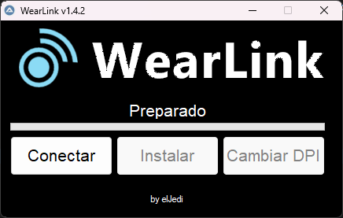

# Wear Link
Herramienta de gestion de Wear Os para Windows

## Características
- Instalar Apks
- Seleccionar DPIs

## Instalación en Windows 10/11
1. Descarga e instala [Autoit](https://www.autoitscript.com/cgi-bin/getfile.pl?autoit3/autoit-v3-setup.zip)
2. Instala [git](https://git-scm.com/download/win).
3. Descarga o clona el repositorio, por ejemplo, `git clone https://github.com/eljedidev/wear-link.git`
4. Ejecuta `app.au3` o haz clic con el boton derecho Run Script

## Tutorial de uso

Puedes ver un breve tutorial en [este enlace] (https://eljedi.com/smartwatch/wear-os/instalar-wearlink/)
